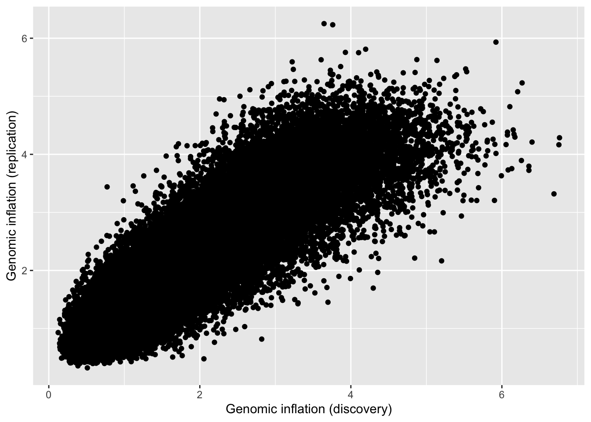
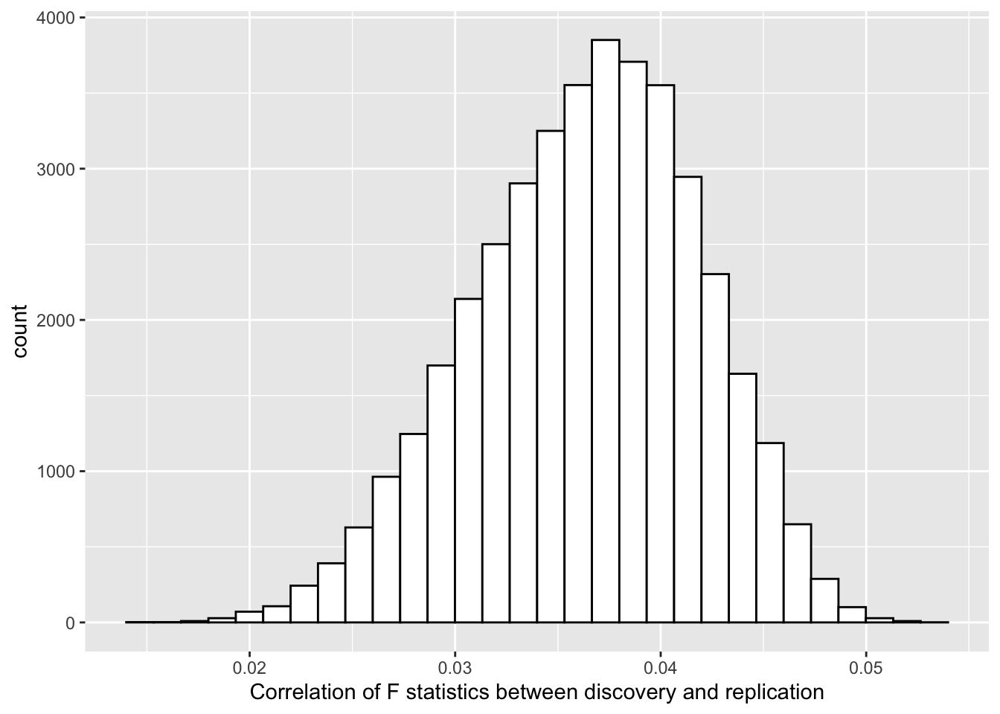

## Abstract

The extent to which genetic interaction (epistasis) contributes to the genetic architecture of human complex traits is expected to be low but remains unknown. A common approach to evaluating this question is to perform or targeted or hypothesis-free searches of pairwise interactions, using an F-test that evaluates if the interaction terms explain more than the marginal terms alone. Using results of 501 genetic interactions previously reported to influence gene expression, along side theory and simulations, this paper seeks to explain why the standard approach is unreliable. We show that it can lead to high false discovery rates, that those false discoveries can have high replication rates, and that without sequence level data and assumptions of constant additive effects being met, the problems are difficult to guard against.

## Introduction

An important component of understanding the genetic architecture of complex traits is the extent to which the effect of a particular locus depends on the genotype at another locus, also known as genetic interaction or epistasis. Knowledge of epistatic influences on complex traits may inform biological understanding of their aetiology, contribute towards improved prediction accuracy, and have implications on natural selection. Along with other non-additive genetic components, the contribution of epistatic variance to complex traits is likely to be small, but beyond analyses of clonal organisms, heritability is seldom estimated in the broad sense where the non-additive components could be captured and decomposed. Instead, researchers have sought to detect interacting genetic loci through association analyses to report instances of epistatic influences on complex traits. 

In a recent review of the literature, it was concluded that of all the many empirical papers that search for epistasis influencing human complex traits it was unlikely that any reported statistical genetic interactions represented robust examples of biological epistasis. The Hemani et al 2014 (H2014) paper, which reported discovery of genetic interactions influencing gene expression levels, and replication in independent datasets, was listed amongst those examples. In this paper we aim to provide a detailed examination of the statistical test used as it is employed widely, but has potential issues which have not yet been described.

## The basic statistical test for 2-locus genetic interactions

Should epistatic interactions influence complex traits, their detection is known to be difficult for two reasons. First, the statistical power for an interaction term to reach significance is low in comparison to a marginal additive effect of similar magnitude. This is because the statistical test typically has a larger number of degrees of freedom, and if the causal variants are not available in the data then loss of signal with decaying LD between the causal variant and the observed variant is squared or quadratic, in comparison to a linear loss for additive effects. Second, the parameter space for two-locus epistasis is O(m^2), hence a much more strict multiple testing correction is required than GWAS under the additive model, if the computational capability exists to test the entire set of pairwise interactions. If not, then the incomplete coverage likely translates into loss of power.

While many methods exist that attempt to circumvent these problems, one analytical strategy has been to bypass statistical power issues by selecting traits to analyse that are likely to have some large effects. In such traits, genetic perturbation could have a more proximal effect in comparison to complex diseases. Recent studies have focused efforts on analysing gene expression levels for epistatic interactions partly for this reason. In H2014 a brute force search strategy was performed, applying a 4 d.f. linear model for each pairwise combination of 528,509 genotyped autosomal single nucleotide polymorphisms (SNPs) against each of 7,339 gene expression levels. The statistical test attemped to capture any joint effect of two independent variants that was not explained by the marginal additive or dominance effects of either of the variants. 

$$
\begin{aligned}
H_{0}&: \sum^{3}_{i=1} \sum^{3}_{j=1} (\bar{x_{ij}} - \bar{x_{i}} - \bar{x_{j}} + \mu)^2 = 0 \\
H_{1}&: \sum^{3}_{i=1} \sum^{3}_{j=1} (\bar{x_{ij}} - \bar{x_{i}} - \bar{x_{j}} + \mu)^2 > 0
\end{aligned}
$$

Here the additive x additive, additive x dominance, dominance x additive and dominance x dominance terms are jointly estimated in the interaction term. This effect decomposition is fundamental to basic quantitative genetic theory, originally formulated by Cockerham (1954), and has been used routinely in the linkage study era and the GWAS era (Cordell 2002, Wei et al 2015). The level of epistasis can be tested for statistical significance using an F test with $4,n-9$ degrees of freedom. A simpler variation is to parameterise the interaction term to include only the additive x additive, though what follows in this paper applies to that approach also.

The 4 d.f. method was used in H2014 with a sample of 846 individuals, and yielded 501 independent pairwise interactions that surpassed a permutation-derived threshold of $p < 2.31 \times 10^{-16}$. The majority of these interactions were long-range 'cis-trans' associations, where one interacting variant was close to the gene whose expression level was influenced, and the other interacting variant was on a different chromosome. In two independent datasets, together comprising 2,131 individuals, 30 of these interactions replicated at a Bonferroni multiple testing correction ($p < 0.05/501$), and 46 replicated at FDR < 0.05.

## A summary of the problems with the original findings

Soon after publication, these findings were further replicated in an independent dataset by Wood et al (2014). However, with the availability of sequence level genetic data, they were able to fine-map the additive effects for each gene expression level where the H2014 genetic interactions were discovered. Typically the fine-mapped additive effects were distinct from the cis-acting interacting variant. Upon including the fine-mapped additive effects as covariates in the interaction models they found that most of the interaction effects substantially attenuated. Following this finding, we found a similar attenuation of effects in the original data by using fine-mapped imputed additive effects as covariates. In light of this exchange, it was clear that the likelihood that the statistical findings in H2014 represented biological epistasis was severely diminished. Importantly, it raised the question of why such a fundamental method was giving rise to unreliable results.

Wood et al (2014) interpreted the original discovery interactions as haplotype effects, a well-understood mechanism by which two loci can appear epistatic but be due to a simple additive effect. Here, the observed loci flank a causal variant and are in incomplete linkage disequilibrium with each other and the causal variant. A statistical interaction between the observed loci can capture more of the additive variance of the causal variant than the marginal additive effects of both the observed loci combined. This explanation for the H2014 was unproven but plausable for the set of cis-cis interactions reported, those where the two interacting loci were each close to the gene whose expression levels they were influencing. Other work has since appeared that investigate the same process. However it does not explain the discovery and attenuation of cis-trans interactions, where the two interacting loci are on different chromosomes, and a fine-mapped cis-additive effect attenuates the interaction effect. In this paper we explore the question of how a single unobserved cis-additive effect can give rise to cis-trans statistical associations. We go on to explore how this influences replication rates, and discuss potential methods for avoiding the problem.

## Inflation of test statistics

If the test statistic for the interaction term can be attenuated with the inclusion of a single additive term, this implies that the interaction test statistic is inflated under the null hypothesis of no epistasis. To begin, we test this assumption by estimating the genomic inflation factor for each of the 501 interactions discovered in H2014. In each case, we ran a genome-wide analysis where we performed an interaction test of the detected cis-SNP against every other SNP excluding those on the cis chromosome. The genomic inflation factor was then calculated for the interaction test statistics across the set of genome-wide tests. Figure 1 shows that for many loci the inflation factor is much larger than the expected under the null, consistent with the idea that the test statistics are inflated. 

There are other possible explanations that could give rise to high genomic inflation factors, such as an epistatic polygenic component, though this is unlikely given the discovery sample size. We also observe that many loci that had discovered associations have low genomic inflation factors, which raises the question of whether this metric is a reliable indicator of false positives.

## Relationship between cis-trans genotype pairs and the cis-causal variant

One way in which the addition of a covariate (the fine-mapped causal variant) can lead to attenuated of the cis-trans interaction is that the fine-mapped causal variant and the interaction term are correlated. To examine this we begin by considering three loci, where locus 1 has an additive causal effect on the trait (the cis-additive effect), locus 2 is in linkage disequilibrium with locus 1 (the cis-interacting locus) and locus 3 is uncorrelated with either 1 or 2 (the trans-interacting locus). Let $y_{i}$ represent the vector of genotype values for each of the three loci ($i \in {1,2,3}$). Using a haploid model for simplicity, such that all values of $y_{i} \in {0,1}$, our objective is to evaluate if the expected covariance between $y_{1}$ and the interaction term $y_{2}y_{3}$ is greater than 0, where 

$$
cov(y_{1},y_{2}y_{3}) = E(y_{1}y_{2}y_{3}) - E(y_{1})E(y_{2}y_{3})
$$

Based on haplotype frequencies we can obtain 

$$
E(y_{1}y_{2}) = p_{11} = p_{1}p_{2} + D
$$

Therefore 

$$
\begin{aligned}
cov(y_{1},y_{2}y_{3}) &= p_{3}(p_{1}p_{2} + D) - p_{1}p_{2}p_{3} \\
                      &= p_{3}p_{1}p_{2} + p_{3}D - p_{1}p_{2}p_{3} \\
                      &= p_{3}(p_{1}p_{2} + D - p_{1}p_{2} \\
                      &= p_{3}D
\end{aligned}
$$

This explains how a cis-trans interaction term could be accounted for by including the fine-mapped variant in the model. 

We next explore what gives rise to a high false discovery rate during the search for interactions, including when the the genomic inflation factor is as expected under the null hypothesis of no interaction. 

## Test statistic inflation under a simplified haploid model

We have empirically observed high genomic inflation factors for the discovered loci. Consistent with this would be the mean test statistic under the null hypothesis of no interaction being higher than expected. But to explain discovered interaction terms where the genomic inflation factor is low, we would need to observe higher variance of the test statistic than expected by chance. Here we use a simplified model to estimate the mean and variance of the test statistic under the null hypothesis of no interaction.

Assume that the phenotype is explained entirely by $y_1$, which represents the fine-mapped additive cis-effect. In this case, what is the distribution of test statistics when testing for interaction between a tagging locus, $y_2$ and another unlinked locus, $y_3$? Here the interaction test amounts to an ANOVA between the models $a$ and $b$:

$$
\begin{aligned}
y_1 &\sim y_2 + y_3 + e_a \\
y_1 &\sim y_2 + y_3 + y_{2}y_{3} + e_b
\end{aligned}
$$

In the haploid example and a single additive x additive interaction term, the interaction test statistic is 

$$
F_{ab} = \frac{(SSE_a - SSE_b) / 1}{SSE_b / (n-4)}
$$

Under the null hypothesis, and $e_a$ and $e_b$ being normally distributed, $F_{ab}$ follows a central F-distribution with $1$ and $n-4$ degrees of freedom. We conducted basic simulations of this model, where we set $p_1 = p_2 = 0.1$, $p_3 = 0.5$, and the LD was either $r_{12} = 0.5$ or 0. in order to generate the values of $y_1$, $y_2$ and $y_3$. We then tested for interaction to obtain $F_{ab}$, and repeated the process 10000 times to obtain a distribution of $F_{ab}$ when there is LD between $y_1$ and $y_2$, and when they are uncorrelated. When uncorrelated the mean and variance of $F_{ab}$ are approximately 1 and 2, following expectation. However when $y_1$ and $y_2$ are correlated the mean and variance of $F_{ab}$ are approximately 3.4 and 23. 

### Theory

The reason behind this inflation is that the error variance of the interaction test becomes a mixture of a binomial and normal distribution, which violates the assumptions of the linear model (LM). Here we continue with the simplified haploid example to illustrate this process. Let the genotypic value of $y_{1.ij} = (y_1 = 1 | y_2 = i, y_3 = j)$ where $i,j \in \{0,1\}$, and let the counts for each genotype combination be:

$$
n_{ij} = n ( 1- p_2 + i(2p_2) - 1))(1 - p_3 + i(2p_3-1))
$$

We can define a test for interaction as

$$
\delta = mean(y_{1.11}) + mean(y_{1.00}) - mean(y_{1.10}) - mean(y_{1.01})
$$

with $mean(y_{1.ij}) = \sum y_{1.ij} / n_{ij}$. Under a linear model we expect that the error variance of each $mean(y_{1.ij})$ to be the same, and a pooled estimate is used. Here we show that this assumption is violated. From the given haplotype frequencies:

$$
\begin{aligned}
E(y_{1.11}) = E(y_{1.10}) &= p(y_1 = 1 | y_2 = 1) \\
                          &= p_{11} / p2 \\
                          &= p_1 + D / p_2
\end{aligned}
$$

and similarly

$$
\begin{aligned}
E(y_{1.00}) = E(y_{1.01}) &= p(y_1 = 0 | y_2 = 0) \\
                          &= p_{00} / p2 \\
                          &= p_1 - D/(1 - p_2)
\end{aligned}
$$

Each of the terms has a binomial variance

$$
var(mean(y_{1.ij})) = E(y_{1.ij})(1 - E(y1.ij)) / n_{ij}
$$

and frequencies

$$
\begin{aligned}
y_2\; & y_3 & n_{ij}/n \\
0\; & 0 & (1 - p_2)(1 - p_3) \\
0\; & 1 & p_2(1 - p_3) \\
1\; & 0 & (1 - p_2)p_3 \\
1\; & 1 & p_2p_3 \\
\end{aligned}
$$

Putting all the terms together gives the exact variance of the test statistic as 

$$
\begin{aligned}
var(\delta) = 
\frac{p_1(1-p_1) + \frac{(1-2p_1)(1-2p_2)D}{p2(1-p2)} - \frac{D^2(1-3p_2(1-p_2))}{p_2^2(1-p_2])^2} }
{c}
\end{aligned}
$$

where $c = n p_2(1-p_2)p_3(1-p_3)$. As a result

$$
\begin{aligned}
c \cdot var(\delta_{LM}) = p_1(1-p_1)(1-r_{12}^2) = var(e_{LM})
\end{aligned}
$$

Thus when using a linear model an incorrect variance of the interaction test is assumed, and this can lead to inflated (or deflated) type-I error rates. The ratio of the exact and linear model variances is the expected value of the linear model F-test. If we first rearrange,

$$
\begin{aligned}
c \cdot var(\delta) = var(e_{LM}) + \frac{D(1 - 2p_i)(1-2p_2)}{p_2(1-p_2)} -
\frac{D^2(1-2p_2)^2}{p_2^2(1-p_2)^2}
\end{aligned}
$$

we can obtain the ratio of test statistic variances

$$
\begin{aligned}
var(\delta)/var(\delta_{LM}) = E(F) = 1 + \frac{D(1 - 2p_i)(1-2p_2)}{p_2(1-p_2)} -
\frac{D^2(1-2p_2)^2}{p_2^2(1-p_2)^2}
\end{aligned}
$$

Unless $D = 0$, $p_2 = 0.5$ or $r_{12} = 1$ the exact variance is different from that under the linear model. Equation (3) also shows that the inflation term does not depend on the allele frequency at the unlinked locus. For the parameters used in the simulation above, the using equation (3) gives $E(F) = 3.47$, agreeing with the results from the simulation.

## Simulations mimicking the original analyses

Having demonstrated that the mean and the variance of the test statistic is higher than expected under a simplified haploid model, we now use simulations to explore the behaviour of the test statistic whilst approximating the original testing conditions in H2014 (Methods). 

There were 846 samples in the discovery and a combined 2131 in the replication datasets used in H2014. We reported *MBNL1* gene expression being influenced by several cis-trans epistatic interactions, where the cis variant was rs13069559. These associations replicated at the Bonferroni level in the independent replication sample. Fitting the fine-mapped additive cis-variant rs67903230 attenuated the cis-trans signals involving rs13069559. Using real genetic data we used the rs67903230 variant to simulate a phenotype with a large additive effect, and then performed the 4df interaction test for association between the originallu discovered cis variant rs13069559 and 502510 genotyped markers, excluding the cis chromosome (chromosome 3). Any pair of loci that had interaction test statistics surpassing a Bonferroni correction were taken forward to replication. As in the original analysis, we only allowed one trans-effect per chromosome, thus the maximum number of cis-trans interactions for a simulation was 21. We performed 40,000 simulations, allowing the phenotypic variance explained by the rs67903230 additive effect to range uniformly from 0 to 50% across the set of simulations.

Figure 2 shows that the genomic inflation factor related strongly to the variance explained by the additive effect. Figure 3 demonstrates that as genomic inflation grows, the number of false positive interactions grows. We also observe that it is possible to obtain several false discovery signals per simulation even when the genomic inflation factor is low.

## Replication rate of false discovery signals

In H2014 we found a replication rate, after strict multiple testing correction (p < 0.05/501) of 6%. An important result in H2014 was that the replication rate of true positive episatic signals is expected to be low compared to additive effects, due to two processes. First, there is a winner's curse in the discovery sample operating on the LD $r^2$ between the causal interacting loci and the observed markers. Second, the decay of the causal interaction signal with lowering LD $r^2$ in the replication sample is rapid. However, under the null hypothesis being true, it is not clear what is to be expected in terms of the replication rate of false positives from the discovery sample. 

Using the simulations described in the previous section, we were able to compare the genomic inflation factor obtained in the discovery data against the replication data. Figure 4 demonstrates a strong relationship, though the correlation of the F-statistics in the discovery and the replication was small (Figure 5). We next asked if a simulation had at least one significant effect, what was the replication rate of that significant effect in the independent replication sample? We used three different significance thresholds for determining replication, 1) FDR within simulation, 2) Bonferroni within simulation and 3) Experiment-wide Bonferroni as used in H2014 (p < 0.05/501). While the relaxed thresholds (1) and (2) could reach replication rates as high as 15%, the experiment-wide threshold (3) required very high genomic inflation to obtain any detectable replication, and the rate when genomic inflation was very high did not surpass 2% (Figure 6). 

These simulations were designed to be as favourable as possible to generate false positive interaction terms, so it is unclear why the H2014 paper found a replication rate that is substantially higher than those found in these simulations. One possibility is that there is a mixture of false positives and true epistatic effects amongst those discovered in H2014.

## Measurement error in the causal additive

We now ask whether it is possible to avoid the inflation that we see in interaction tests. An intuitive approach would be to use a two stage strategy, where first the additive effects are fine-mapped for the phenotype, and second the interaction search is performed with the fine-mapped variants included as covariates in the model. In the previous simulations, however, we observed that even when there are very small additive effects it is possible to find false positive interaction test statistics. This implies that if there is incomplete tagging of the additive effects by the fine-mapping strategy, we would fail to completely protect against inflated test statistics. This is confirmed through a basic simulation showing that interaction test statistic inflation occurs when the causal variant is included in the linear model, but there is measurement error of the causal variant (Figure 7).

To evaluate how this problem might transpire empirically, we performed a new set of simulations in which we constructed a phenotype using a variant typed in the UK10K sequence dataset as the cis additive causal effect. We then developed four datasets in which to perform the analysis - 1) retaining SNPs only present on Illumina CoreExome array, 2) variants imputed from this array to the HapMap2 reference panel, 3) variants imputed from this array to 1000 genomes reference panel, 4) the original sequence data. In each case we identified the top variant and tested for interaction against remaining SNPs. Figure 8 demonstrates that only when the sequence level data is available is it possible to prevent inflation of the test statistic. 

## Additive effect heterogeneity

We have shown that the additive cis-causal variant must be measured without error and included as a covariate in order to avoid test statistic inflation of the interaction term. However there is a scenario in which even this will not be sufficient - if there is heterogeneity of the causal variant's effect across the samples. Typically we assume that the estimate of the causal effect in a linear model represents the influence of the variant on all individuals. However, if there is variation in the effect and we only capture the average effect, the residual error term becomes a mixture of variance not captured by the causal variant, and variance not captured by the average effect estimate of the causal variant. Here we demonstrate through simple haploid simulations that if there is any effect heterogeneity, even when the causal variant is included as a covariate, the interaction term will be inflated (Figure 9).

## Discussion

We have shown that a large additive effect can contaminate standard approaches to obtaining genetic interaction test statistics. The problem arises because neighbouring variants that imperfectly tag that additive effect are liable to exhibit higher mean and substantially higher variance of the test statistic. Ultimately this can lead to high false discovery rates, and those are likely to be correlated between datasets which can lead to some degree of replication. 

In order to guard against this problem it may be insufficient to fit the fine-mapped additive effects if there is any measurement error, suggesting that sequence level data may be required. We also show that genomic inflation factors are not always reliable metrics for detecting cases where false positives may have arisen.

There is a long history of problems arising in genetic analysis due to the interplay between statistical tests and background genetic architecture being poorly understood or experimental design being misaligned. Linkage studies on complex traits have exhibited poor replication, and it was recently shown that under a polygenic architecture the LOD score could be inflated, thus the standard threshold was not sufficiently conservative. Candidate gene studies also have a legacy of poor replication due to what is likely to be a combination of low power under a polygenic model and publication bias. In the case of the F-statistic used for detecting epistasis, the problem of inflation that we describe here arises due to two forces. First, when there is strong but imperfect tagging between a large additive causal variant and a nearby locus, the mean and the variance of the test statistic for interaction terms of the tagging locus will be inflated. Second, an exhaustive search for epistasis will allow the ascertainment of loci that have the appropriate tagging qualities to maximise test statistic inflation. This problem will exist even in a more targeted search for interactions with a known additive locus against other loci, if the true additive effect isn't completely captured. Such a scenario can arise even when the causal variant is known but is poorly typed e.g. due to imperfect imputation.

How we reliably perform tests for epistasis going forwards remains a challenging question. There are scenarios which our work here indicates that test statistic inflation is unlikely. We have shown that adjusting for fine-mapped cis-additive effects does not completely protect the interaction test statistic at tagging loci from inflation if genotyping accuracy is not guaranteed. It does however improve matters substantially, and so we advocate that this should be done routinely. 

A second approach is that for any loci that are detected with interaction effects, a permutation test of that specific interaction could be performed where the phenotype and cis-effect are held constant while the trans-effect (i.e. the variant that is not tagging an additive effect) is permuted. This would give an empirical distribution of the test statistic in the context of potential inflation.  Non-parametric tests, if computationally tractable, may also be immune to this form of interaction test statistic inflation. 

Over and above these approaches, using sequence data offers the most robust solution to protecting against inflation, though we warn that even here errors may remain. For example, point estimation issues could still pose a problem, i.e. where there is heterogeneity in the additive effect. If there is no large additive effect, as is the case with most complex traits and for most trans regions of 'omic variables, then the problem of the residual being a mixture of binomial and normal distributions is unlikely to exist. 

## Methods

### Genomic inflation in the discovery data

For each of the 501 interactions reported in H2014, we used the original discovery data to estimate the genomic inflation factor of the interaction test statistic, where we tested for interaction of the cis-locus against all trans-loci. This resulted in approximately 500,000 interaction test statistics per analysis (varying depending on the cis-chromosome, as that was omitted for the test). We calculated the genomic inflation factor as the observed median chi-square statistic divided by the expected expected value of 0.455.

### Simulations of discovery-replication scenarios

Our objective is to evaluate the expected behaviour of replication of interaction tests under the null hypothesis that there is no interaction (and therefore any discovered interactions are false positives). To do this we create two datasets, one representing the discovery sample (n = 846) and another representing the replication (n = 2131). We use genotype data from the Avon Longitudinal Study of Parents and Children (ALSPAC) study to create the two genetic datasets, such that realistic LD structures are present and there is genotype resampling between the discovery and replication. The ALSPAC data was imputed to 1000 genomes reference panel (Phase 3 version 1), and used to simulate the phenotype under an additive model, where a large additive effect was caused by a single variant. 

#### Phenotype simulation

Here we want to simulate a phenotype that is due to a single large additive effect, and then perform interaction tests with that causal variant absent from the set of markers that are tested. In H2014 we reported *MBNL1* gene expression being influenced by several cis-trans epistatic interactions. In that scenario, rs67903230 was the fine-mapped additive cis-variant, which we will treat as the causal variant in these simulations. It was absent from the genotype data used to conduct the interaction analysis, and instead rs13069559 emerged as a cis-tagging variant, which showed interaction associations against variants on other chromosomes, and also replicated in independent datasets. We attempt to mimic this scenario here. We define the phenotype to be simulated as

$$
\begin{aligned}
y_i = b_{c}x_{ic} + e_i
\end{aligned}
$$

where $x_{ic} \in \{0,1,2\}$ is the genotype value for individual $i$ at the causal variant. In this case we use the rs67903230 in the ALSPAC data. The residual error term $e_i \sim N(0, 1-b^2_c var(x_c))$ where additive effect $b_c = \sqrt{\frac{r_c^2 var(y)}{var(x)}}$ such that across the simulations $r^2_c \sim U(0,0.5)$. 

#### Analyses

Once the phenotype was simulated using the causal variant, we were able to obtain F-statistics for the interaction term of the tagging variant (rs13069559) against every trans-variant (excluding those on the cis-chromosome). We retained only 502,510 autosomal markers to match the original discovery data, excluding those on chromosome 3 which is where *MBNL1* resides. The 4 d.f. interaction test was performed between rs13069559 and each of these markers sequentially. We did this both in the discovery and the replication dataset, so that we could compare the distributions of F-statistics between the two, where we expect variation to only arise due to resampling of genotype values.

This process of creating a phenotype, performing the cis-trans analysis in the discovery and the cis-trans analysis in the replication, was repeated 40,000 times. 

To mimic the discovery-replication process, for a particular simulation we tested if any cis-trans interactions (4 d.f. test) were significant at a Bonferroni corrected threshold, and then looked up their associations in the replication. 

### Cis-adjustment simulations

Our objective is to observe the test statistic inflation when the cis-additive causal variant is included as a covariate in the interaction model, but there is some degree of measurement error in the causal variant. We used the haploid simulation scenario for simplicity, in which there are four variants $x_c \sim Binom(1, 0.1)$ the causal variant, $x^*_c \sim Binom(1, 0.1)$ the observed causal variant which has some measurement error $1-r^2_c$, a tagging cis-variant $x_t \sim Binom(1, 0.1)$ which has some LD $r^2_t$ with the causal variant $x_c$, and an unlinked variant $x_u \sim Binom(1, 0.5)$. When $r^2_c < 0$ $x^*_c$, this represents poor imputation accuracy at the causal variant or a fine-mapped tagging variant in incomplete LD with the causal variant. We simulated a continuous phenotype $y \sim bx_x + e$ where $e \sim N(0, \sigma^2_{x_c}/2)$ thus two thirds of the variance was explained by $x_c$. The following statistical test was performed to test for interaction between the tagging cis-variant $x_t$ and the unlinked locus $x_u$, after fitting the measured fine-mapped variant as a covariate

$$
y \sim x^*_c + x_t + x_u + x_{t}x_{u}
$$

Simulations were performed for 1000 haploid samples, and over a combination of values for $r^2_c \in \{0, 0.1, 0.2, 0.3, 0.4, 0.5, 0.6, 0.7, 0.8, 0.9, 1\}$ and $r^2_c \in \{0, 0.2, 0.4, 0.6, 0.8, 1\}$ where each scenario was repeated 500 times.

### Sequence data simulations

TODO

### Additive effect heterogeneity simulations

Typically the causal effect parameter is treated as constant across all individuals. However, if there is heterogeneity in this parameter, such that linear models only estimate the average causal effect, then the error variance is a combination of variance not captured by the causal variant, and variance not captured due to misestimation of the per-individual effect size. The objective of this set of simulations is to demonstrate that even when there is knowledge of the causal variant and that causal variant is measured perfectly, test statistic inflation can arise due to assumption that the causal additive effect is constant across individuals. Let the causal effect be 

$$
b \sim N(\bar{b}, \sigma^2_{b})
$$

and the phenotype for individual $i$

$$
y_i = b_i x_{ci} + e_i
$$

where $x_{ci} \sim Binom(1, 0.1)$ and $e \sim N(0, \sigma^2_e - \sigma^2_{het})$. We constructed the error variance to add additional noise on top of that due to causal effect heterogeneity, such that in a linear model $\sum \bar{b}x_{ci}$ explained $r^2_c$ of the variance. Thus, the variance due to effect heterogeneity $\sigma^2_{het} = var(\sum b_i x_{ci}) - var(\sum \bar{b}x_{ci})$, and the variance of the residual error

$$
\sigma^2_e = \frac{var(\sum b_i x_{ci}) - r^2_c var(\sum \bar{b}x_{ci}))}{r^2_c}
$$

We then tested for interaction between the perfectly measured causal variant and an unlinked locus $x_u \sim Binom(1, 0.5)$ using the model

$$
y \sim x_c + x_u + x_{c}x_{u}
$$

Across the simulations, we used 1000 samples, set $\bar{b} = 1$ and used a range of $\sigma^2_b \in \{0, 0.01, ..., 0.4\}$, with 500 replicates per scenario. In each scenario, the variance explained by the average effect of the causal variant remains the same at $r^2_c = 0.5$, but the proportion of the residual variance due to point estimation error varies due to changing $\sigma^2_b$.

## Figures

![Figure 7: Test statistic inflation (y-axis) due to measurement error of the additive causal variant. Here a tagging variant and an unlinked variant for interaction, and the causal variant is included as a covariate. There is varying amounts of measurement error of the causal variant (x-axis), and LD between the the tagging variant and causal variant (colours). When there is no measurement imprecision, there is no test statistic inflation. When there is measurement imprecision the only scenarios in which there is no test statistic inflation is if the tagging variant (which is being tested for interaction) has LD $r^2$ of 0 or 1 with the true causal variant.](figures/measurementerror.png)

![Figure 9: Heterogeneity in the additive causal effect across individuals can induce test statistic inflation (y-axis), even when the true causal variant is measured perfectly and included as a covariate in the linear model. Here the average causal effect explains 50% of the variance of the phenotype, but the proportion of this that is due to heterogeneity of the causal effect on the phenotype varies (x-axis). Only when there is no heterogeneity is there no inflation of the interaction test statistic (colours).](figures/pointestimation.png)
